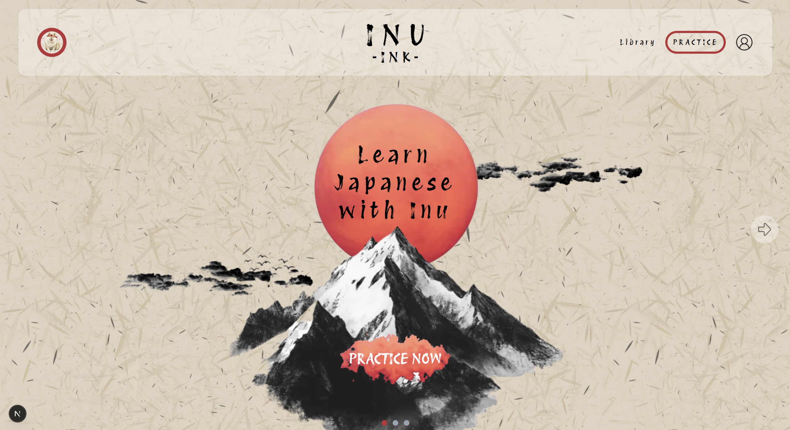
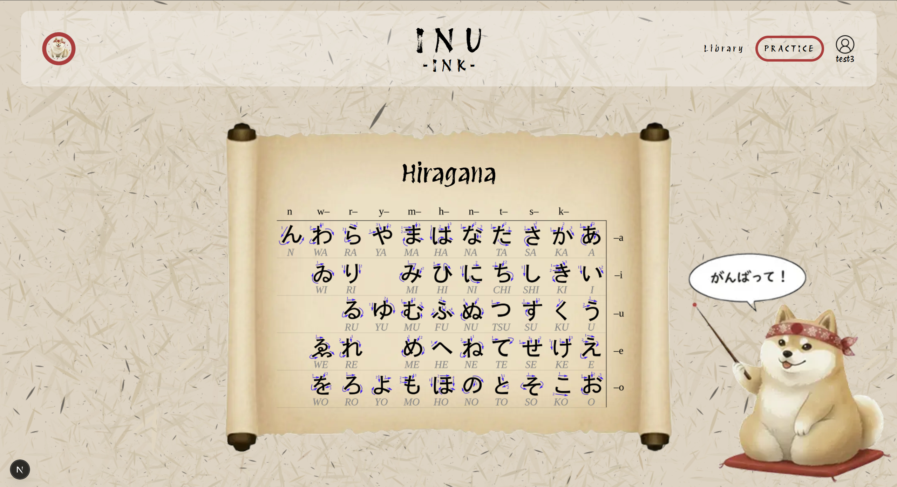
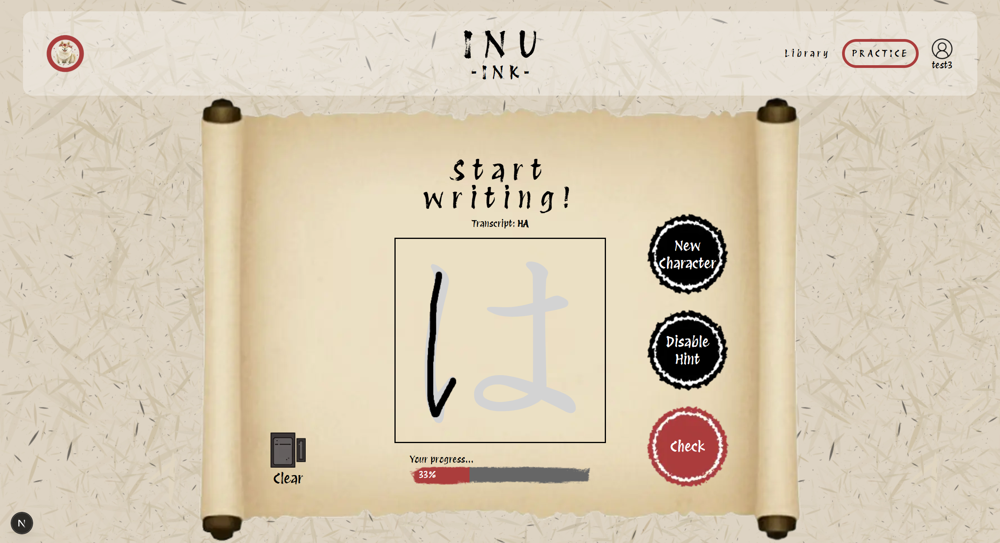
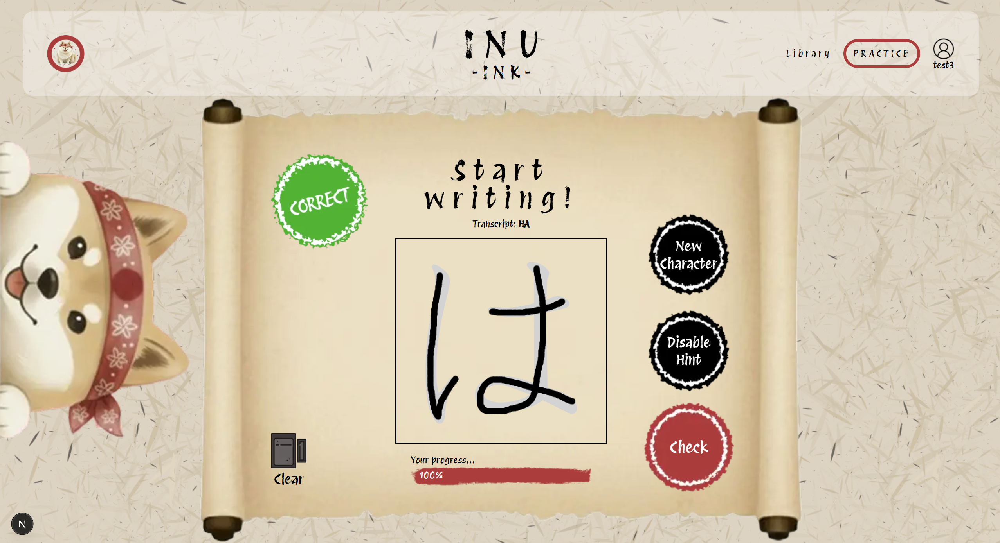
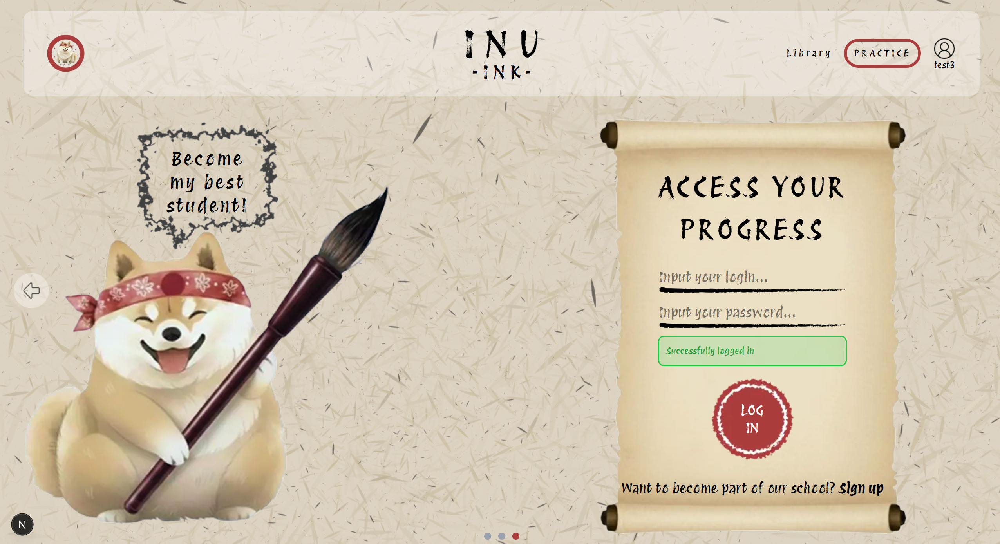

<br />
<div align="center">
  <a href="https://github.com/linyvez/InuInk">
    
  </a>

  <h3 align="center">InuInk</h3>

  <p align="center">
    A web application for training Japanese calligraphy!
  </p>
</div>

## About The Project

There are many great applications that help users with learning Japanese. However, all of them have several limitations which I decided to account for when creating InuInk.

InuInk introduces:

- **Focus on Japanese calligraphy** - you can practice drawing the characters directly in the application (currently only Hiragana is available)
- **Hints** - feel free to learn first and master later
- **Instant feedback** - our Sensei Shiba Inu will inform you about your success or failure, and you can see your progress stroke after stroke
- **Library** - browse all characters, as well as the correct order of strokes for each

### Built With

- [![Next][Next.js]][Next-url]
- [![React][React.js]][React-url]
- [![Tailwind][Tailwind]][Tailwind-url]
- [![Drizzle][Drizzle]][Drizzle-url]
- [![Turso][Turso]][Turso-url]

### Getting Started

To get a local copy up and running follow these simple steps.

### Prerequisites

- Node.js
- npm

```sh
npm install npm@latest
```

### Installation

1. Clone the repo

```sh
git clone https://github.com/linyvez/InuInk.git
```

2. Install NPM packages

```sh
npm install
```

3. Set up Environment Variables (Required for Authentication)

Create a .env file in the root directory and add your database credentials:

```
TURSO_CONNECTION_URL=
TURSO_AUTH_TOKEN=
```

4. Push Database Schema

```sh
npx drizzle-kit push
```

5. Run the project locally

```sh
npm run dev
```

## Usage

Main page:


Library:


Draw a character with a hint:


Get feedback from Sensei Shiba Inu:


Log in to your account:


## Roadmap

- [x] Add Hiragana for practice
- [x] Add Library
- [x] Add registration and authentication
- [ ] Add statistics
- [ ] Add other Kanji

[Next.js]: https://img.shields.io/badge/next.js-000000?style=for-the-badge&logo=nextdotjs&logoColor=white
[Next-url]: https://nextjs.org/
[React.js]: https://img.shields.io/badge/React-20232A?style=for-the-badge&logo=react&logoColor=61DAFB
[React-url]: https://reactjs.org/
[Tailwind]: https://img.shields.io/badge/Tailwind_CSS-grey?style=for-the-badge&logo=tailwind-css&logoColor=38B2AC
[Tailwind-url]: https://tailwindcss.com/
[Drizzle]: https://img.shields.io/badge/Drizzle-ORM-green
[Drizzle-url]: https://orm.drizzle.team/
[Turso]: https://img.shields.io/badge/Turso-26F0AF
[Turso-url]: https://turso.tech/
